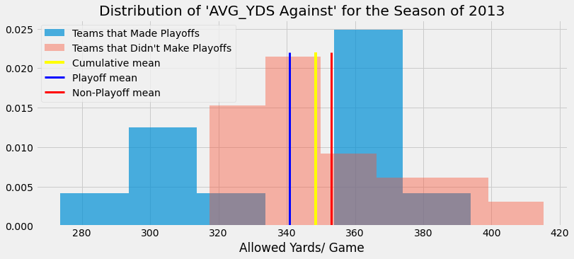

# NFL Defensive Relevence 

## Scientific Question:

*“Does Defensive strength for an NFL team, based on yards allowed, increase or decrease your probability of making the playoffs in any given season?“* 

## During EDA I Found: 

In order to focus on what data point should be used for comparison, I needed to determine a data point/ multiple data points I could use to generally rank defenses. I chose to analyze:
    - Average yards allowed/ game
    - Average points allowed/ game

Using those two points as keys, the data was split into two samples. The first sample was teams that had made the playoffs for any given season over the 11 year time frame (2009 - 2019), while the second was the teams that did NOT make the playoffs. 

### Initial Testing - EDA Continued:
Analyzing and comparing the samples over a single season, on either data point, proved to be very inconclusive. Due to the lack lower number of data collected from only one season, most of the graphical representations seemed less than suitable. See Below graphs from 2009, 2011, 2013, 2015, 2017, 2019 for a better understanding. 

Essentially, no representation confidently portrayed a normalized distribution to back up the choice of using a Welch's t-test. 

![2011][AVG_YDS_2011.png]

![2015]['images/AVG_YDS_2015.png']
![2017]['images/AVG_YDS_2017.png']
![2019]['images/AVG_YDS_2019.png']

As depicted, nothing substantial above to continue with. 

### Refined Testing - EDA Continued

## Hypothesis Test 1:

## Results

## Hypothesis Test 2:

## Results

## Reflection

## References