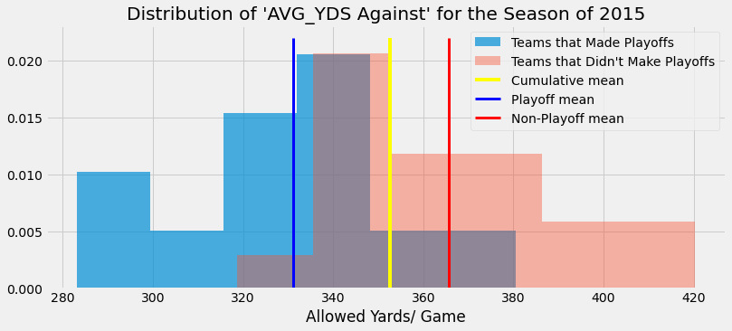

# NFL Defensive Relevence 

## Scientific Question:

*“Does Defensive strength for an NFL team, based on yards allowed, increase or decrease your probability of making the playoffs in any given season?“* 

## During EDA I Found: 

In order to focus on what data point should be used for comparison, I needed to determine a data point/ multiple data points I could use to generally rank defenses. I chose to analyze:
    - Average yards allowed/ game
    - Average points allowed/ game

Using those two points as keys, the data was split into two samples. The first sample was teams that had made the playoffs for any given season over the 11 year time frame (2009 - 2019), while the second was the teams that did NOT make the playoffs. 

### Initial Testing - EDA Continued:
Analyzing and comparing the samples over a single season, on either data point, proved to be very inconclusive. Due to the lack lower number of data collected from only one season, most of the graphical representations seemed less than suitable. See Below graphs from 2009, 2011, 2013, 2015, 2017, 2019 for a better understanding. 

Essentially, no representation confidently portrayed a normalized distribution to back up the choice of using a Welch's t-test. 

As depicted, nothing substantial above to continue with. 

### Refined Testing - EDA Continued

I then decided to test, based on the full time span of my scraped data. This was much more conclusive and allowed me to start seeing patterns, normalized distributions, and get to a point where I had the keys I needed to conduct my hypothesis testing using a Welch's T-test. Below is graphical representations of some of the "Overall" findings/ comparisons. 

## Hypothesis Test 1:

***Scientific Question:***

Does Defensive strength for an NFL team, based on yards allowed, increase or decrease your probability of making the playoffs in any given season? 

***Null Hypothesis:***

The mean yrds_against for teams that make the playoffs = the mean yrds_against of teams that did not make the playoffs

$p_M = P(\text{avg_yards against for TMs that make playoffs})$
$p_D = P(\text{avg_yards against for TMs that don't make playoffs})$

$$ H_0: \ p_M = p_D $$

***Alternative Hypothesis:***

$$H_1: \ p_M \neq p_D $$

***Determine the 'Test' Statistic:***

Yearly averages of yards allowed/ game of each team in the last 11 NFL seasons. Splitting them into two samples. 

- SAMPLE 1: Teams in this time frame season who made the Playoffs
- SAMPLE 2: Teams in this time frame season who did not make the Playoffs

***Determine Distribution under Null Hypothesis:***

The data being tested under the Welch's T-Test is normally distributed. This was proven by creating a histogram of each sample's mean, and observing the "bell-curve".

***Determine Type of Hypothesis Test:***

In order to Test this specific Hypothesis, we need to use the Welch's T-Test. We do this because the Welch's T-Test is defined as such: 

**"...a two-sample location test which is used to test the hypothesis that two populations have equal means."**

Because our Null Hypothesis states that both samples(Playoffs & non-Playoffs Teams) will indicate that our populations share identical means, we can use Welch's test to reject or accept that notion.  

***Determine Significance Level ($\alpha$) :***

In order to make a strong argument towards rejection or acceptance of the Null Hypothesis we need to set our " $\alpha$ " < '0.05'. For this test, we will set it to:

$\alpha = 0.02$

***Collecting Data:***

Defensive Statistics for every NFL team per season over a 2009 - 2019 timeframe (11 seasons). 

Data, per team, is broken down by the yearly average of the following columns:

- Yds/G = average yards allowed per game
- Playoffs = Boolean value (True or False) of making the playoffs for that season

***Calculate p-value:***

Based on the Welch's T-Test (Yds/G) the calculated p-value is:

- pvalue = **1.4605969165431278e-06** / p-value = **0.0000014601**

***Decide whether to reject/ accept the Null Hypothesis:***

Because the p-value is lower than our dictated significance level ($\alpha = 0.02$):

p-value(Yds/G) < $\alpha$

## Results

The Null Hypothesis is Rejected

## Hypothesis Test 2:

***Scientific Question:***

Does Defensive strength for an NFL team, based on points allowed, increase or decrease your probability of making the playoffs in any given season? 

***Null Hypothesis:***

The mean pnts_against for teams that make the playoffs = the mean pnts_against of teams that did not make the playoffs

$$ p_M = P(\text{avg_pnts against for TMs that make playoffs}) $$
$$ p_D = P(\text{avg_pnts against for TMs that don't make playoffs}) $$

$$ H_0: \ p_M = p_D $$

***Alternative Hypothesis:***

$$H_1: \ p_M \neq p_D $$

***Determine the 'Test' Statistic:***

Yearly averages of points allowed/ game of each team in the last 11 NFL seasons. Splitting them into two samples. 

- SAMPLE 1: Teams in this time frame season who made the Playoffs
- SAMPLE 2: Teams in this time frame season who did not make the Playoffs

***Determine Distribution under Null Hypothesis:***

The data being tested under the Welch's T-Test is normally distributed. This was proven by creating a histogram of each sample's mean, and observing the "bell-curve".

***Determine Type of Hypothesis Test:***

Because our Null Hypothesis states that both samples(Playoffs & non-Playoffs Teams) will indicate that our populations share identical means, we can use Welch's test to reject or accept that notion. 

***Determine Significance Level ($\alpha$) :***

In order to make a strong argument towards rejection or acceptance of the Null Hypothesis we need to set our " $\alpha$ " < '0.05'. For this test, we will set it to:

$\alpha = 0.02$

***Collecting Data:***

Defensive Statistics for every NFL team per season over a 2009 - 2019 timeframe (11 seasons). 

Data, per team, is broken down by the yearly average of the following columns:

- Pts/G = average yards allowed per game
- Playoffs = Boolean value (True or False) of making the playoffs for that season

***Calculate p-value:***

Based on the Welch's T-Test (Pts/G) the calculated p-value is:

- pvalue = **5.621094393622213e-25**

***Decide whether to reject/ accept the Null Hypothesis:***

Because the p-value is lower than our dictated significance level ($\alpha = 0.02$):

p-value(Pts/G) < $\alpha$

## Results

The Null Hypothesis is Rejected
